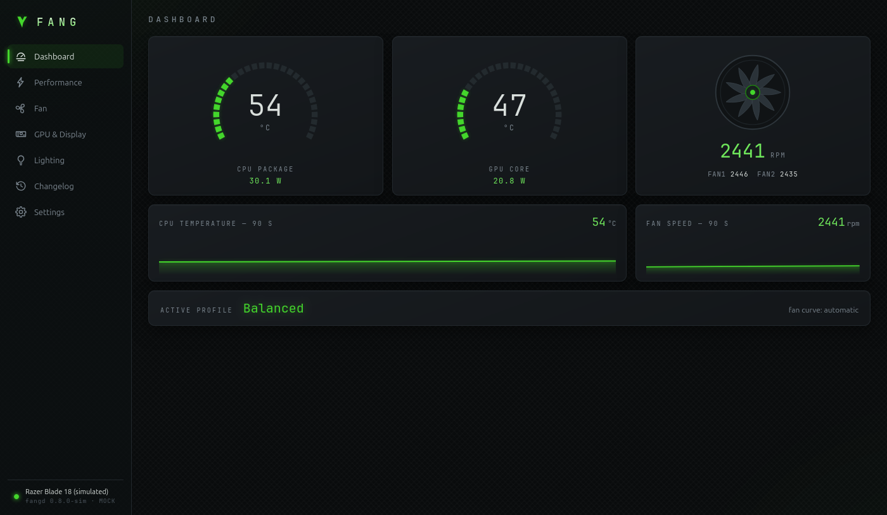
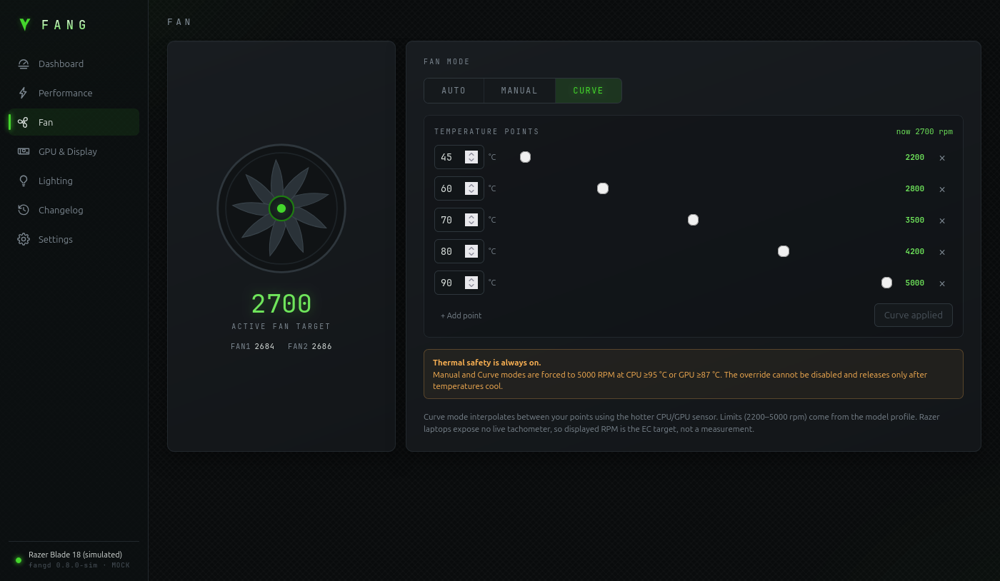
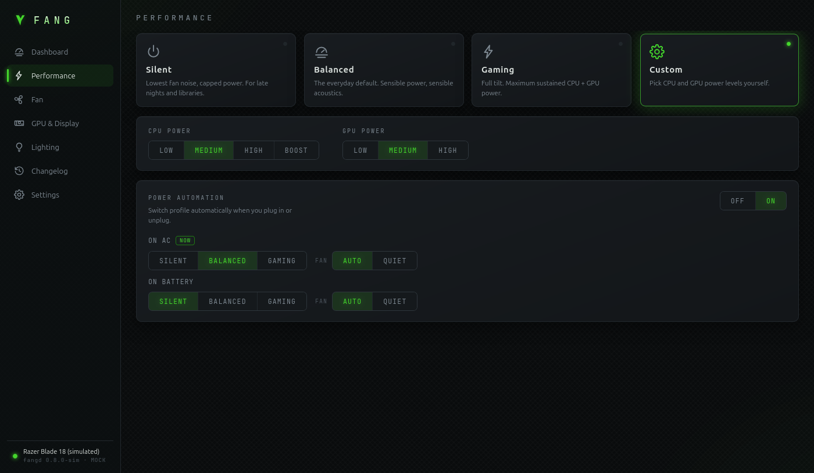
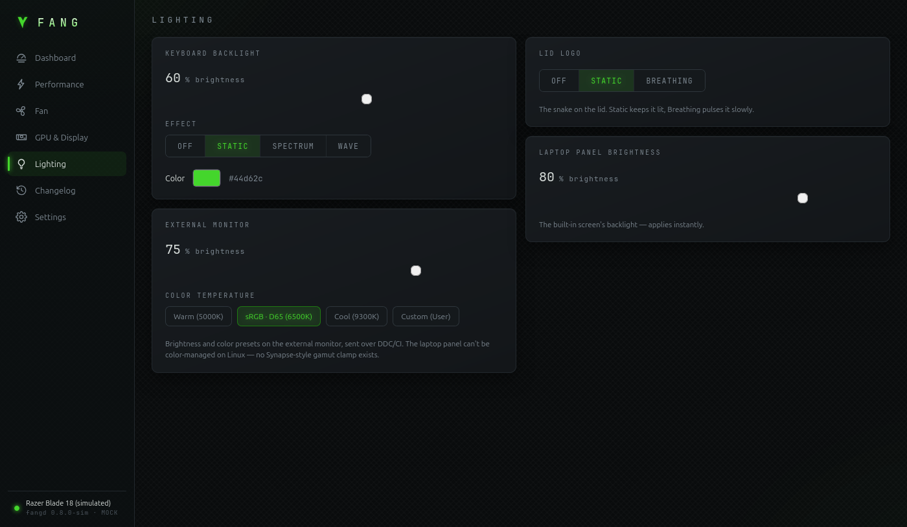
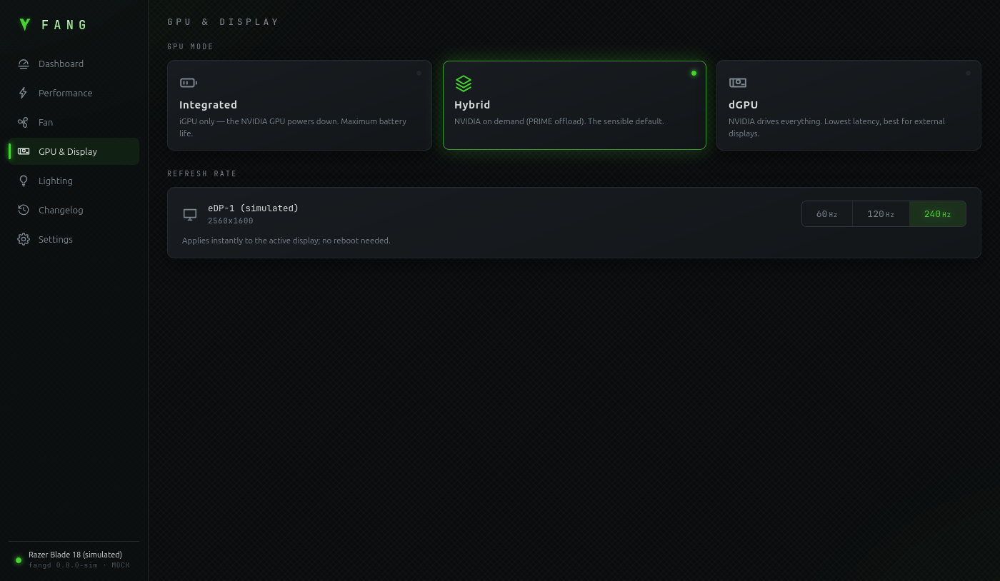

# Fang — Razer Blade Control Center for Linux

[](https://github.com/bladeandsoulx/fang-razer-linux/actions/workflows/ci.yml)
[](LICENSE)

**Control your Razer Blade without Windows.**

Fang is a free, open-source Linux app for performance modes, fan curves,
battery charging, keyboard lighting, GPU switching, displays, and live
temperatures.

## Install — one command

> ### Copy. Paste. Done.
>
> Open **Terminal**, paste this one line, and press **Enter**:

```bash
curl -fsSL https://github.com/bladeandsoulx/fang-razer-linux/releases/latest/download/install.sh | bash
```

**That is it.** When installation finishes, open **Fang** from your app menu.

Run the command as your normal user—do not add `sudo`. Enter your password only
when the installer asks. If it says group access was added, log out and back in
once, then open Fang.

The installer chooses the correct packages for your Linux system, checks them,
installs the app and background service together, upgrades an existing Fang
installation safely, and refuses downgrades.

## See Fang in action



| Custom fan curves with thermal protection | Performance modes and power automation |
|---|---|
|  |  |
| Keyboard, logo, and display lighting | GPU mode and refresh-rate controls |
|  |  |

_These screenshots use Fang's built-in hardware simulator. The real app has the
same interface._

## What Fang can do

- 🎛️ **Performance modes:** Silent, Balanced, Gaming, and Custom CPU/GPU power.
- 🌀 **Fan control:** Automatic, fixed RPM, or your own fan curve.
- 🔌 **Power automation:** Change performance and fan settings when you plug in
  or unplug the charger.
- 🔋 **Battery care:** Limit charging to 50–80% on supported models.
- 🌈 **Lighting:** Control keyboard brightness/effects and the lid logo.
- 🎮 **GPU mode:** Switch between integrated, hybrid, and dedicated graphics.
- 🖥️ **Displays:** Change refresh rate, brightness, and supported external
  monitor color settings.
- 📊 **Live dashboard:** See temperatures, power use, fan speed, and a
  90-second history.
- 🔁 **Tray and autostart:** Quickly switch modes and restore settings after
  reboot or sleep.

Fang focuses on **Razer Blade laptops**. It does not currently remap
mice/keyboards or create macros, so it is not a complete Razer Synapse
replacement for every Razer device.

## Will it work on my laptop?

Fang recognizes **48 Razer Blade models from 2015–2025**. Each known model has
its own safe fan limits and feature list.

Tested x86_64 Linux bases:

- Ubuntu 22.04 and 24.04
- Debian 12 and 13
- Fedora 43 and 44

Linux Mint, Zorin OS, Pop!_OS, and other derivatives are accepted when they
report one of those supported Ubuntu, Debian, or Fedora bases. The installer
warns that derivatives are not tested directly. Other CPU architectures and
unsupported base releases are rejected before anything is installed.

Unknown Razer product IDs are monitor-only by default. Check the
[full model list](crates/fang-protocol/src/models.rs) or follow
[the hardware testing guide](HARDWARE_TESTING.md) when adding a model.

## Safety

Fang controls the laptop's embedded controller directly, but hardware-changing
features have guardrails:

- Fan speeds and curves are kept inside the limits for your model.
- A guard that cannot be disabled forces maximum fans at CPU **95 °C** or GPU
  **87 °C**. Missing or stale CPU temperature data also forces maximum fans.
- Stopping the background service restores the laptop's automatic fan control.
- App/daemon version mismatches allow status viewing but block hardware changes.
- Custom CPU **Boost** means more heat and fan noise.

The laptop's own thermal protections continue to work as an additional safety
layer.

## More install options

<details>
<summary><strong>Check the installer before running it</strong></summary>

```bash
curl -fLO https://github.com/bladeandsoulx/fang-razer-linux/releases/latest/download/install.sh
less install.sh
bash install.sh
```

This lets you read the script before it asks for administrator access.

For an extra integrity check, download the installer and checksum manifest from
the pinned v0.9.4 release:

```bash
curl -fLO 'https://github.com/bladeandsoulx/fang-razer-linux/releases/download/v0.9.4/{install.sh,SHA256SUMS}'
grep '  install.sh$' SHA256SUMS > install.sh.sha256
sha256sum --check install.sh.sha256
```

</details>

<details>
<summary><strong>Install release packages manually</strong></summary>

Download both packages from the same release, then install them together:

```bash
# Ubuntu or Debian
sudo apt install ./fangd_0.9.4-1_amd64.deb ./Fang_0.9.4_amd64.deb

# Fedora 43 or 44
sudo dnf install ./fangd-0.9.4-1.x86_64.rpm ./fang-0.9.4-1.x86_64.rpm
```

Enable the background service and give your user access:

```bash
sudo systemctl enable --now fangd
sudo usermod -aG fang "$USER"
```

Log out and back in once after adding the group. To remove Fang, run
`sudo apt remove fang fangd` or `sudo dnf remove fang fangd`.

</details>

<details>
<summary><strong>Build from source on Ubuntu or Debian</strong></summary>

```bash
git clone https://github.com/bladeandsoulx/fang-razer-linux
cd fang-razer-linux
sudo ./packaging/install-from-source.sh
```

The script installs the build tools, builds and installs Fang, starts its
background service, and gives your user access.

</details>

## Development

You can develop Fang on any OS without Razer hardware.

```bash
# Terminal 1: run the daemon with simulated hardware
cargo run -p fangd -- --mock --tcp 127.0.0.1:7331

# Terminal 2: run the desktop app
cd app
npm install
npm run tauri dev
```

For the browser-only UI simulator:

```bash
cd app
npm run dev
```

Run the Rust tests with `cargo test --workspace`. See
[`app/scripts/version.mjs`](app/scripts/version.mjs) for release version
management.

Real hardware control uses the protected `/run/fangd.sock` Unix socket. TCP is
available only with simulated hardware on a numeric loopback address.

## Support Fang

Fang's in-app **Support** screen lists the creator's BTC, USDT, and Solana
donation addresses. USDT supports BNB Smart Chain (BEP20) and Ethereum (ERC20).

## Credits and license

Fang is licensed under [GPL-2.0](LICENSE).

Much of its hardware knowledge—EC packets, the 48-model device table, battery
limiting, and lighting commands—comes from
[Razer-Control](https://github.com/Rintastic247/Razer-Control) by
**Rintastic247** (GPL-2.0), the maintained continuation of
[razer-laptop-control-no-dkms](https://github.com/Razer-Linux/razer-laptop-control-no-dkms).
Fang also uses information from [OpenRazer](https://openrazer.github.io/).
If Fang helps you, please consider
[supporting the Razer-Control author](https://www.paypal.com/donate/?hosted_button_id=H4SCC24R8KS4A).

Assisted-by: OpenAI GPT-5.6 via Codex and Claude Fable 5 via CLI.

Fang is not affiliated with or endorsed by Razer Inc. “Razer” and “Synapse”
are trademarks of Razer Inc.
